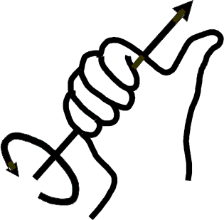
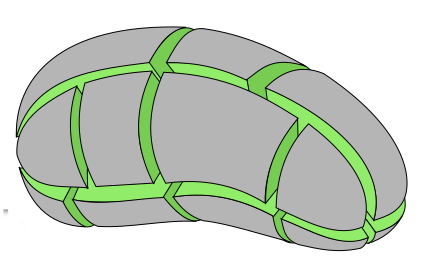

Welcome to the homepage of **Math F253 Calculus III**, Spring 2023, in the [Dept. of Mathematics and Statistics](http://www.uaf.edu/dms/) at the [University of Alaska Fairbanks](http://www.uaf.edu/).

#### Instructor:  [Ed Bueler](http://bueler.github.io/)

Email me at [elbueler@alaska.edu](mailto:elbueler@alaska.edu).  I hold [office hours](http://bueler.github.io/OffHrs.htm) in Chapman 306C.

### Canvas course page

Log in to [canvas.alaska.edu/courses/13188](https://canvas.alaska.edu/courses/13188) for:

  * your grades
  * link to Gradescope for submitting Homework
  * solutions to Homework
  * Zoom link for Tuesday group tutoring
  * other Announcements

### Getting Started

* Read the [Syllabus](assets/general/syllabus.pdf).

* See the [Schedule](assets/general/schedule.pdf).  Check it often to find out what happens next!

* The textbook is online: [OpenStax Calculus Volume 3](https://openstax.org/details/books/calculus-volume-3).

* Do the [Homework](homework.html).  Solutions are [available in advance at the Canvas page](https://canvas.alaska.edu/courses/13188/modules)!  Your Homework will be graded for completion and effort.  You will need to scan and upload each [Homework](homework.html) assignment as a single PDF file in [Gradescope](https://canvas.alaska.edu/courses/13188/external_tools/114?display=borderless).  See the [Tech Help](techHelp.html) page for help on scanning and uploading.

* Prepare for the upcoming weekly [Quizzes](quizzes.html).

* There are [two Midterms and a Final](exams.html).  See the [Exams](exams.html) tab for the sections covered and old exams for review.

### Resources

* The [Math & Stat Tutoring Lab](https://www.uaf.edu/dms/mathlab/index.php) is **open** for in-person tutoring and online tutoring!  You can sign up for online tutoring.

<!--
* The [Quizzes](quizzes.html) and [Exams](exams.html) tabs include old versions with solutions.
/-->

* What are we studying?  Check out these Wikipedia pages:
   * [vectors](https://en.wikipedia.org/wiki/Vector)
   * [dot product](https://en.wikipedia.org/wiki/Dot_product)
   * [cross product](https://en.wikipedia.org/wiki/Cross_product)
   * [partial derivatives](https://en.wikipedia.org/wiki/Partial_derivative)
   * [multiple integrals](https://en.wikipedia.org/wiki/Multiple_integral)
   * [cylindrical coordinates](https://en.wikipedia.org/wiki/Cylindrical_coordinate_system)
   * [spherical coordinates](https://en.wikipedia.org/wiki/Spherical_coordinate_system)
   * [vector fields](https://en.wikipedia.org/wiki/Vector_field)
   * [gradient](https://en.wikipedia.org/wiki/Gradient)
   * [divergence](https://en.wikipedia.org/wiki/Divergence)
   * [curl](https://en.wikipedia.org/wiki/Curl_(mathematics))
   * [line integrals](https://en.wikipedia.org/wiki/Line_integral)
   * [Green's theorem](https://en.wikipedia.org/wiki/Green%27s_theorem)
   * [divergence theorem](https://en.wikipedia.org/wiki/Divergence_theorem)
   * [Stokes' theorem](https://en.wikipedia.org/wiki/Stokes%27_theorem)

 &nbsp; &nbsp;  "right-hand-rule for curl") &nbsp; &nbsp; 

---
_Site design derived from the [coordinated Calc I website](https://uaf-math251.github.io/), an original [Jekyll](https://jekyllrb.com/) design by [David Maxwell](https://damaxwell.github.io/)._

